# 🔐 Microsoft Hybrid AD + Microsoft XDR + Sentinel Detection Lab

## 📌 Overview

## Educational Context

This project was completed as part of my Cybersecurity studies and as part of my independent professional development. It focuses on hybrid identity security, cloud-based threat detection, and the Security Operations Centre (SOC) monitoring using Microsoft security technologies.

This project demonstrates a hybrid identity and security monitoring setup using:

- 🧠 **Azure AD Connect** (Hybrid AD join)
- 🛡️ **Microsoft Defender for Endpoint (MDE)**
- 📊 **Microsoft Sentinel (SIEM)**
- ⚙️ **Microsoft Intune (MDM/MEM)**
- 🚨 **Microsoft XDR alerting**
- 💣 Simulated attack: **Mimikatz LSASS Memory Dump**

## 🎯 Objectives

- Connect on-premises AD to Azure AD using AD Connect
- Onboard Windows Server and Workstation to Defender for Endpoint
- Enable Microsoft Sentinel for centralised logging and incident management
- Use Intune for compliance and visibility
- Simulate credential dumping (Mimikatz) and detect it in Defender XDR and Sentinel

## 🏗️ Architecture

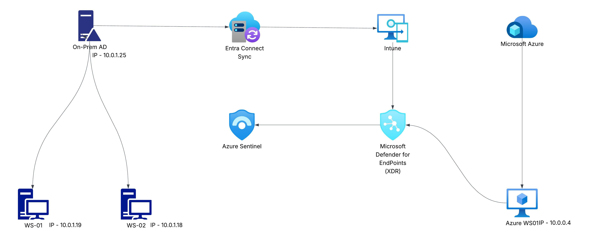

## ⚙️ Configuration Steps

### ✅ Azure AD Connect Setup

  
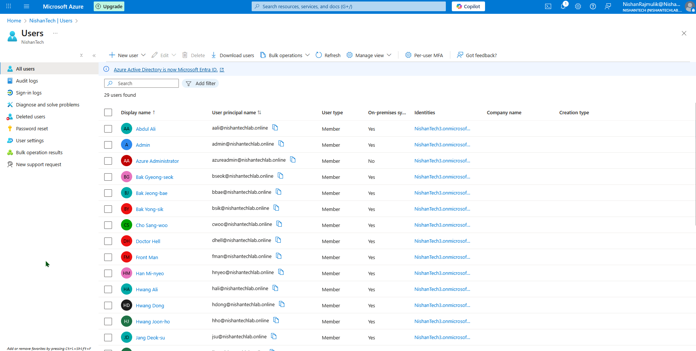

### ✅ Microsoft Defender for Endpoint Onboarding

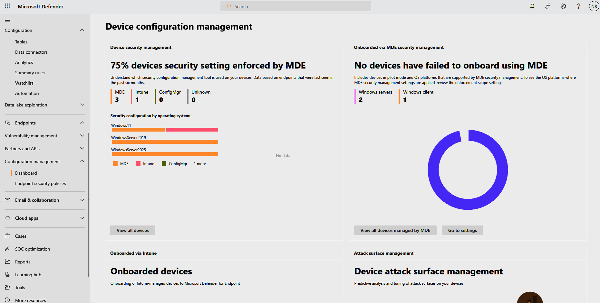  
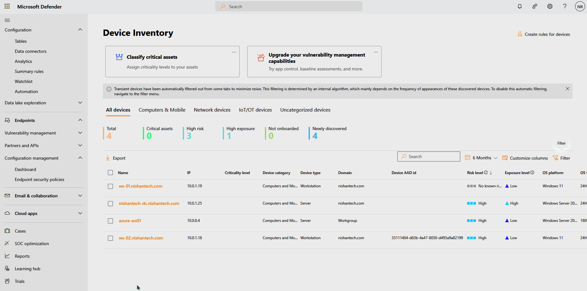

## 🧪 Attack Simulation

- Mimikatz used on on-prem Windows Server (`sekurlsa::logonPasswords`)
- Alert triggered in Microsoft Defender XDR
- Logs visible in Sentinel

### 📸 Defender XDR Alert on Domain Controller

- Alert Overview:  
  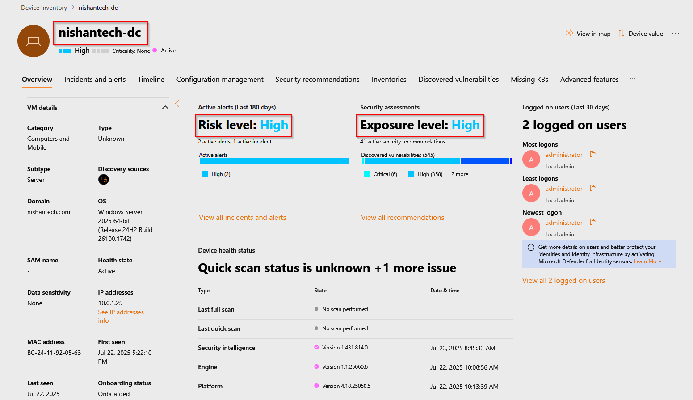

- Mimikatz Detected:  
  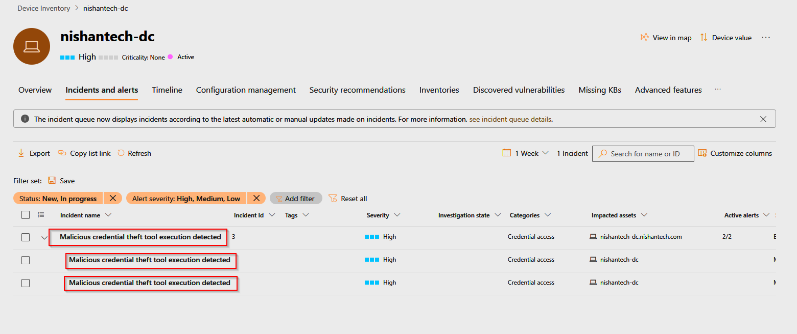

- Execution Timeline:  
  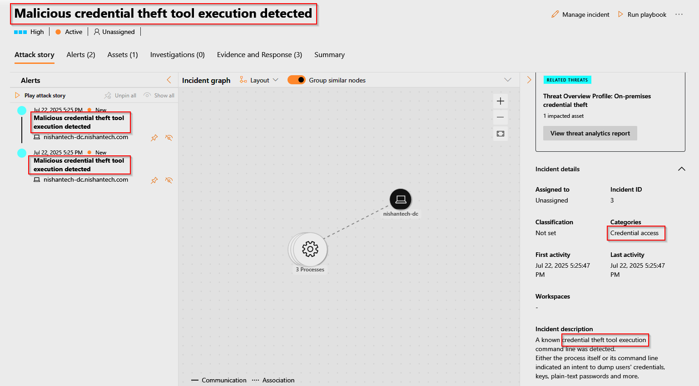

- Process Tree:  
  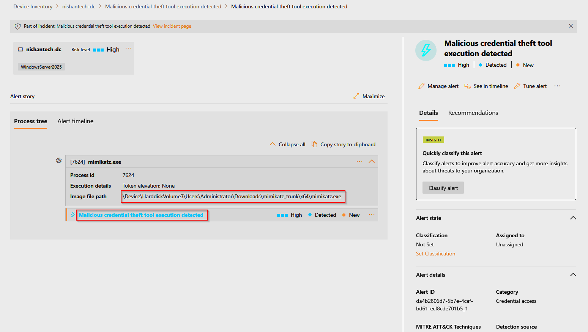

### 📸 Defender XDR Alert on Workstation WS02

- Alert Overview:  
  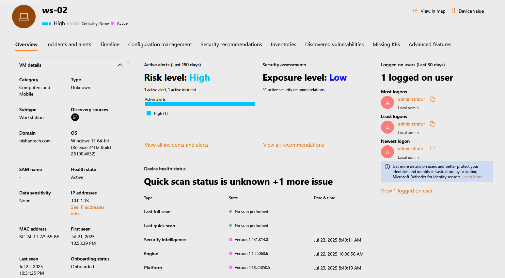

- Mimikatz Detected:  
  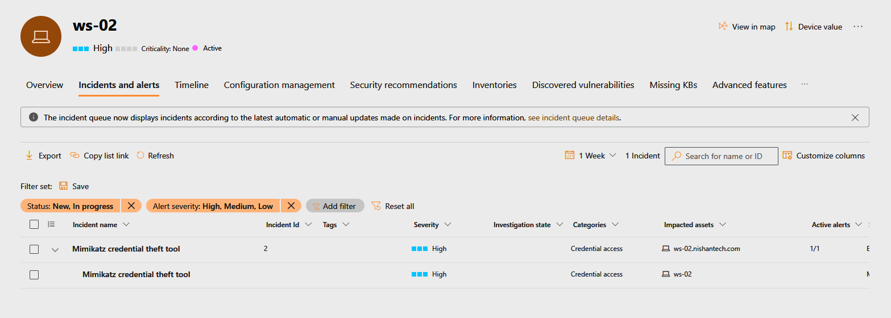

- Threat Details:  
  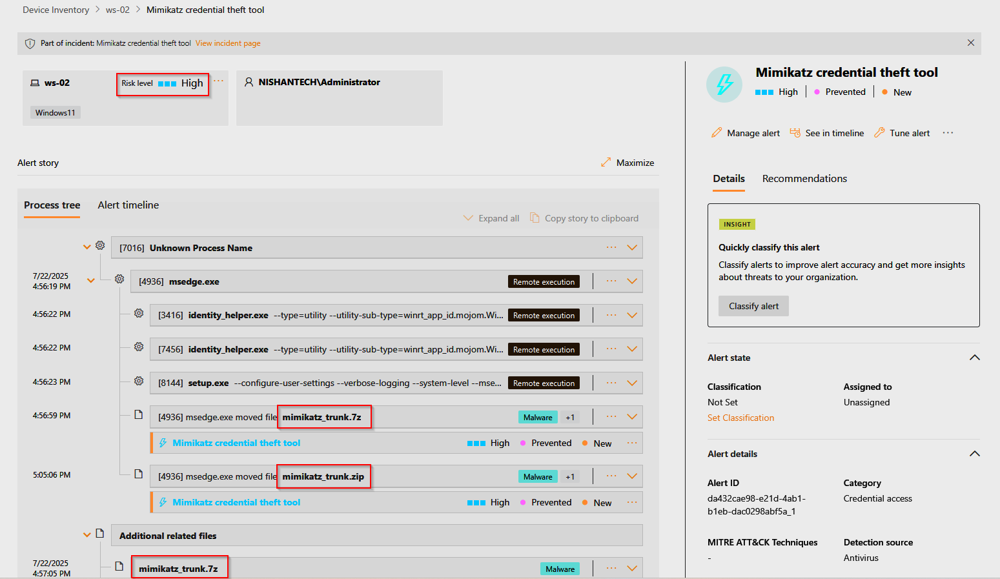

### 📸 Sentinel Logs and Dashboard

- Mimikatz Logs in Sentinel:  
  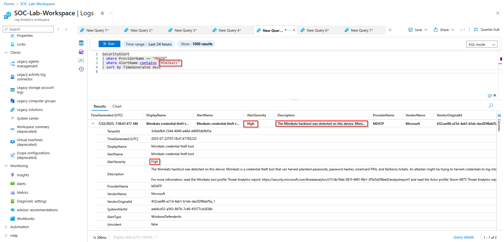

- MDATP Logs in Sentinel:  
  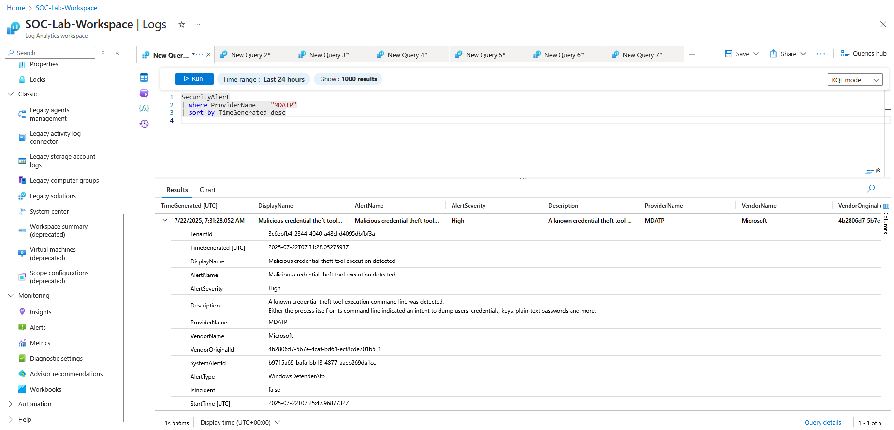

- Sentinel SOC Dashboard:  
  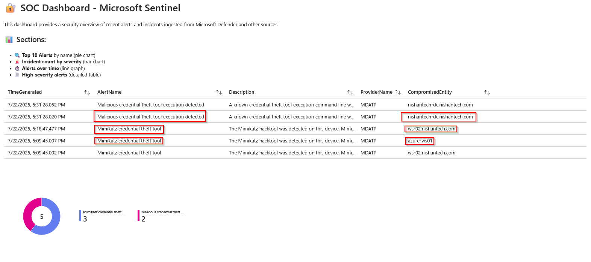

## 🧠 Learning Outcomes

- Understanding of hybrid identity integration
- Hands-on with Microsoft XDR & SIEM
- Detection engineering basics (simulating & detecting attacks)
- Cloud-native threat response and visibility

## 🧰 Tools Used

| Tool | Role |
|------|------|
| Azure AD | Cloud identity |
| AD Connect | Sync on-prem AD |
| Microsoft Defender | Endpoint protection |
| Microsoft Sentinel | SIEM |
| Intune | MDM & policy enforcement |
| Mimikatz | Attack simulation |

---

## Reflection

This project strengthened my understanding of hybrid Active Directory environments and cloud-based security monitoring. I learned how identity, endpoint detection, and SIEM platforms integrate to provide effective detection and response. This experience supports my career goal of working in a SOC or cloud security role.

## 🧵 Project Author

**Nishan Rajmulik**  
Cybersecurity Enthusiast | Blue Team Focus  
[LinkedIn](https://www.linkedin.com/in/nishanrajmulik)
